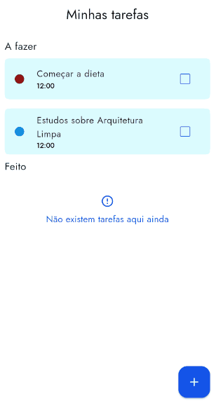

<h1 align="center"> Todo 📒 </h1>

## Sobre
Projeto de lista de tarefas, nele utilizo conhecimentos de banco de dados para criar uma aplicação que lista tarefas e permite adiministrá-las.

## Funcionalidades
1. Listar todas as tarefas (a fazer e feitas);
2. Adicionar uma nova tarefa;
3. Excluir uma tarefa;
4. Atualizar uma tarefa.

<p align="center">
  
</p>


## Tecnologias e bibliotecas

Esse projeto foi desenvolvido utilizando o Framework [Flutter](https://flutter.dev/) e a Linguagem [Dart](https://dart.dev/).

Algumas bilbiotecas também foram utilizadas:

> `Sqflite`: Bibliotecas utilzada para criar um banco de dados local.

## Como executar

Primeiro você deve [instalar flutter](https://docs.flutter.dev/get-started/install). Então, você pode clonar e entrar na pasta do projeto:

```bash
git clone https://github.com/jhoisz/todo
cd todo
```

Agora, para testar, você deve instalar os pacotes/dependências e usar um dispositivo conectado ao seu computador ou usar um emulador:

```bash
flutter pub get
flutter run
```
